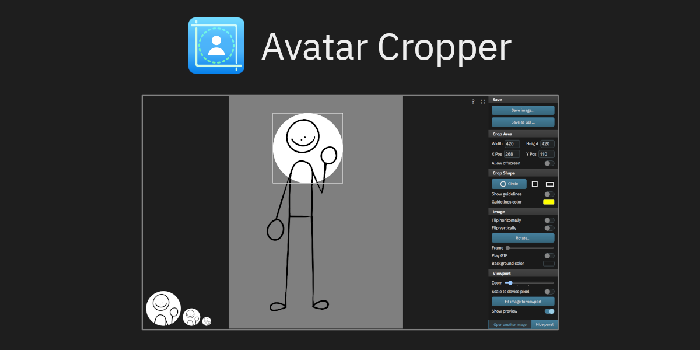

# Avatar Cropper
Simple and accurate avatar cropping tool that runs in your browser. Made with extremely paranoid people in mind. You'll never miss a single pixel ever again!

**Use it here:** [https://leadrdrk.com/avatarcropper](https://leadrdrk.com/avatarcropper)



### ⚠️ Beware of fake/copycat sites ⚠️
I do not own, operate or endorse "avatarcropper.app" and any other website that claims to be this app specifically. "Avatar Cropper" is not a unique idea by any means, but these authors have copied this specific app's source code, modified it with AI, removed all attributions to the original project and failed to disclose the source code, even going as far as completely claiming it as their own. Such actions are a gross violation of the GNU AGPLv3 which is this project's license, and therefore these copies are unethical, plagiarised AI slop, done with bad intentions in mind.

**I am not responsible for any of the content on these sites. Use them at your own risk.**

The only canonical site for Avatar Cropper is [https://leadrdrk.com/avatarcropper](https://leadrdrk.com/avatarcropper) unless noted otherwise in the future. You can use the hosted version, or run it locally by yourself as shown below.

# Features
- Works great on both mobile and desktop.
- Progressive Web App support.
- GIF support: Crop a specific GIF frame or save cropped image as animated GIF.
- Image rotation/flipping and filters.
- Preview your avatar as if it was being used on a real website.

# Development

## Barebone
This project uses Parcel as its build tool. 

Simply run `npm run start` to start the development server. If this is your first time, run `npm install` first to install the dependencies. 

Use `npm run build` to build the project.

## Docker

You can use Docker to build and spawn the application. 

Clone this repo and run the following commands:

````
# build the image
docker build -t avatarcropper -f Dockerfile .

# run the container
docker run --rm -p 1234:1234 avatarcropper:latest
````
Alternatively, use Docker Compose:

````
# build and run the container via docker-compose.yml
docker compose up
````

The application will be accessible at http://127.0.0.1:1234.

# Translations
The following languages are available for the project:
- English (natively supported)
- Vietnamese (natively supported)

Don't see your language on the list? You can help by adding it yourself!
<details>
<summary>How to add a language</summary>

- Before continuing, check the i18n folder first to see if your language is already being worked on.
- If a translation does not exist for your language yet:
    1. Fork the repo.
    2. Create a new branch for your translation.
    3. Go to the `i18n` folder.
    4. Copy the `vi-vn.json` file and rename it accordingly.
        - The name must be an ISO 639-1 code with country (if needed)
        - e.g. `en-us` is for English (United States)
    5. Translate all the strings in your newly created file.
    6. Add your language to `langs.json`
    7. Add your language to the README, in the Translations section.
        - Format: `- Language (added by [@username](https://github.com/username))`
    8. Commit your changes and create a pull request.
- If you didn't understand a single thing above: Create a new issue with your translation file and I'll do it for you!
- You should also update your translation whenever new strings are added.
    - Occasionally check the `vi-vn.json` file for changes if possible.
</details>

# License
Licensed under [GNU AGPLv3](LICENSE)

As per the GNU AGPLv3, you may use, modify and host this app as you wish, but you **must credit the original author and disclose the source code, modified or not.** This is not legal advice. Please read the license for the full terms and conditions.

External project licenses:
- [IBM Plex Sans](https://github.com/ibm/plex): Open Font License
- [omggif](https://github.com/deanm/omggif): MIT License
